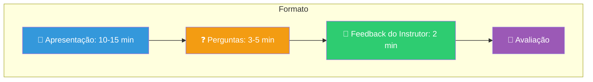

# Slide 5: Apresentações Individuais

**Horário:** 13:00 - 15:30

---

## 🎯 Apresentações — Regras



---

## Critérios de Avaliação

| Critério | Peso | O que será avaliado |
|----------|------|---------------------|
| **Funcionalidade** | 30% | Endpoints funcionam, frontend conecta, fluxo completo |
| **Arquitetura** | 20% | Hexagonal respeitada, separação de camadas, ports/adapters |
| **Qualidade de Código** | 15% | Clean Code, naming, tratamento de erros, DTOs |
| **Testes** | 15% | Testes unitários + integração, cenários relevantes |
| **Git & PR** | 10% | Commits semânticos, PR organizado, Code Review feito |
| **Apresentação** | 10% | Clareza, demo funcional, decisões explicadas |

---

## Enquanto colegas apresentam

### O que FAZER:
- Prestar atenção e anotar dúvidas
- Fazer perguntas construtivas ao final
- Observar soluções diferentes da sua
- Aprender com os erros e acertos dos outros

### O que NÃO fazer:
- Mexer no celular
- Trabalhar no seu projeto
- Interromper durante a apresentação
- Fazer perguntas para "testar" o colega

---

## Perguntas que o Instrutor pode fazer

```
"Por que você escolheu cachear esse endpoint e não aquele?"
"O que acontece se a API do TheMovieDB estiver fora do ar?"
"Me mostra como o Circuit Breaker age na prática?"
"Se tivesse que adicionar um novo endpoint, onde você mexeria?"
"Qual teste te deu mais confiança?"
```

> **Objetivo das perguntas**: não é "pegar" ninguém. É validar que o aluno **entendeu** o que fez, não apenas copiou.

---

## Ordem das Apresentações

A ordem será definida no início do período. Sugestão: sorteio ou voluntários.

| # | Aluno | Horário Estimado |
|---|-------|-----------------|
| 1 | —     | 13:00 - 13:20   |
| 2 | —     | 13:20 - 13:40   |
| 3 | —     | 13:40 - 14:00   |
| 4 | —     | 14:00 - 14:20   |
| 5 | —     | 14:20 - 14:40   |
| — | ☕ Intervalo | 14:40 - 14:50 |
| 6 | —     | 14:50 - 15:10   |
| 7 | —     | 15:10 - 15:30   |
