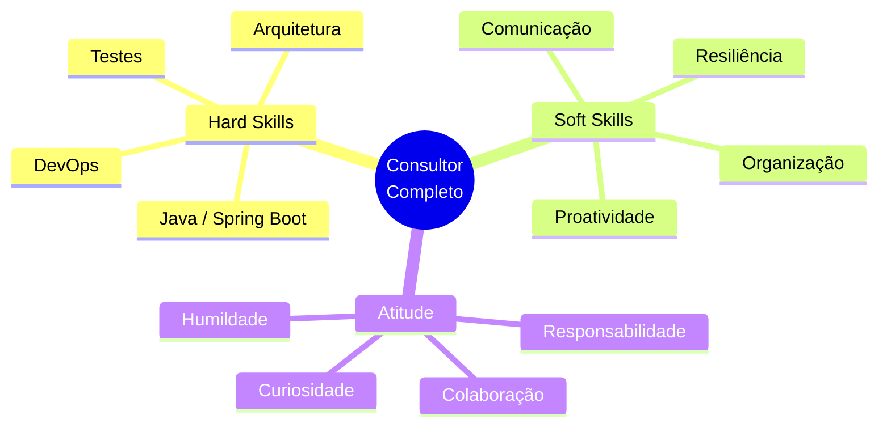
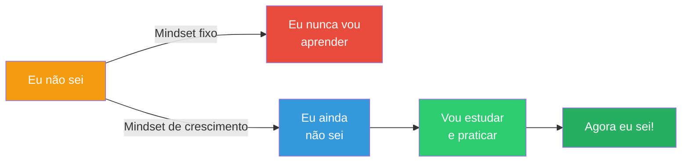

# Slide 6: Soft Skills para Consultoria

**Horário:** 15:30 - 16:00

---

## 🧠 Além do Código: O que diferencia um bom consultor



---

## Os primeiros 90 dias no cliente

| Fase | O que fazer | O que evitar |
|------|-------------|--------------|
| **Semana 1-2** | Ouvir, observar, anotar, perguntar | Querer mudar tudo logo |
| **Semana 3-4** | Pegar tasks pequenas, entregar bem | Pegar task grande sem entender o contexto |
| **Mês 2** | Contribuir em code review, sugerir melhorias | Criticar o código sem oferecer solução |
| **Mês 3** | Propor refactorings, documentar, mentorear | Achar que já sabe tudo |

---

## Comunicação com o cliente

### ✅ Como se comunicar bem:

```
❌ "Isso tá errado"
✅ "Percebi que esse trecho poderia ter um comportamento inesperado em cenário X, 
    que tal a gente validar?"

❌ "Não sei fazer isso"
✅ "Ainda não trabalhei com isso, mas vou pesquisar e trago uma proposta até amanhã"

❌ "O prazo é impossível"
✅ "Para entregar com qualidade, precisaria de X dias. 
    Posso entregar uma versão simplificada no prazo atual?"
```

---

## Lidando com desafios reais

### Código legado
- Não reclame — entenda o contexto em que foi escrito
- Comece adicionando testes antes de refatorar
- Faça mudanças incrementais

### Pressão por prazo
- Comunique riscos cedo
- Negocie escopo, não qualidade
- Documente decisões técnicas

### Feedback negativo
- Ouça sem interromper
- Peça exemplos concretos
- Monte um plano de ação

---

## O Mindset de Crescimento



> **Lembre-se**: todo sênior já foi júnior. A diferença é a constância em aprender.
