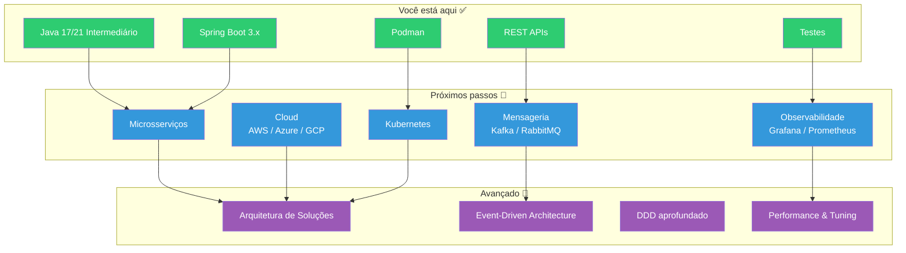
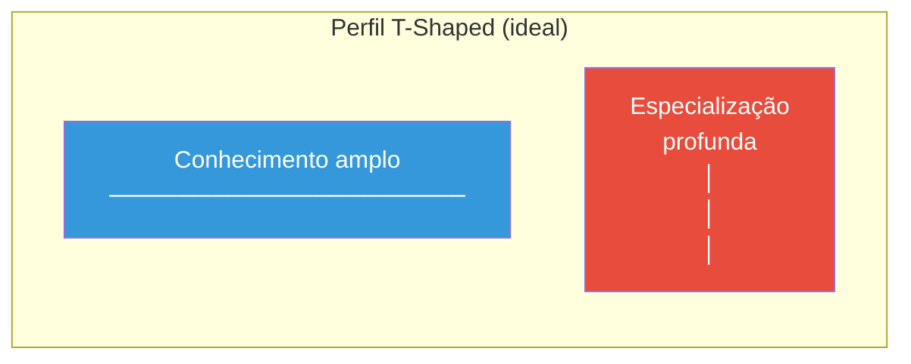

# Slide 7: Carreira e Próximos Passos

**Horário:** 16:00 - 16:30

---

## 🗺️ Roadmap do Desenvolvedor Java

---

## Certificações que valem a pena

| Certificação | Nível | Investimento | Recomendação |
|-------------|-------|-------------|--------------|
| **Oracle Certified Professional (OCP) Java 17** | Intermediário | ~R$ 1.200 | ⭐⭐⭐⭐⭐ Essencial |
| **Spring Professional** | Intermediário | ~R$ 1.500 | ⭐⭐⭐⭐ Muito bom |
| **AWS Cloud Practitioner** | Iniciante | ~R$ 500 | ⭐⭐⭐⭐ Bom custo-benefício |
| **AWS Solutions Architect Associate** | Intermediário | ~R$ 800 | ⭐⭐⭐⭐ Se for para cloud |
| **Kubernetes CKA** | Avançado | ~R$ 2.000 | ⭐⭐⭐ Para DevOps/SRE |

---

## Comunidades e Eventos

### 🇧🇷 Brasil
- **SouJava** — Maior comunidade Java do Brasil
- **TDC (The Developers Conference)** — Evento com trilha Java
- **QCon São Paulo** — Arquitetura e engenharia
- **DevOpsDays** — Para quem quer ir além do código

### 🌍 Global
- **Devoxx** — Maior evento Java da Europa
- **Spring I/O** — Conferência oficial Spring
- **JakartaOne** — Futuro do Java Enterprise

### 💻 Online
- **dev.to**, **Medium** — Escreva artigos, compartilhe aprendizados
- **GitHub** — Contribua com projetos open source
- **Stack Overflow** — Responda perguntas, aprenda respondendo

---

## Especialista vs Generalista

### O que significa:
- **Horizontal**: saber um pouco de frontend, cloud, banco, DevOps
- **Vertical**: ser muito bom em uma coisa (ex: backend Java, arquitetura)

> O mercado valoriza quem tem profundidade + colabora com outras áreas.

---

## Recursos para continuar aprendendo

| Recurso | Tipo | Link |
|---------|------|------|
| Baeldung | Blog/Tutorial | baeldung.com |
| Spring Guides | Documentação | spring.io/guides |
| Java Brains | YouTube | youtube.com/@JavaBrains |
| Alura | Plataforma BR | alura.com.br |
| Udemy (Spring Boot) | Curso | Procure cursos com 4.5+ estrelas |
| "Clean Architecture" (Uncle Bob) | Livro | Leitura essencial |
| "Effective Java" (Joshua Bloch) | Livro | Referência definitiva |
| "Domain-Driven Design" (Eric Evans) | Livro | Para aprofundar DDD |
