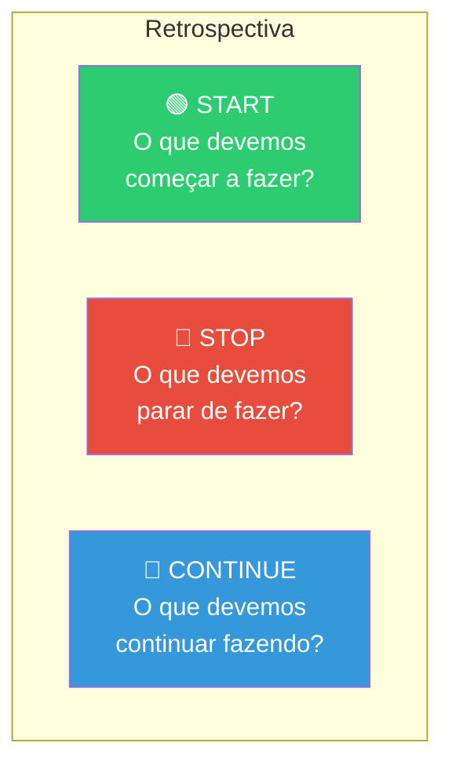

# Slide 8: Feedback e Retrospectiva

**Horário:** 16:30 - 17:00

---

## 🔄 Retrospectiva — Formato Ágil

Vamos usar o formato **Start / Stop / Continue**:

---

## Como funciona

1. **5 min** — Cada aluno escreve post-its (ou anota) em 3 categorias
2. **10 min** — Compartilhamento: cada um lê seus itens
3. **5 min** — Discussão e agrupamento de temas comuns

### Exemplos:

| 🟢 Start | 🔴 Stop | 🔵 Continue |
|----------|---------|-------------|
| Praticar TDD desde o início | Copiar código sem entender | Usar Podman em projetos |
| Estudar padrões de projeto | Ignorar testes | Code reviews com colegas |
| Contribuir em open source | Commitar tudo junto | Arquitetura hexagonal |
| Escrever documentação | Nomes genéricos em variáveis | Usar branches e PRs |

---

## Feedback do Instrutor

### O que foi muito bom nesta turma:
- *(preenchido ao vivo)*

### Onde a turma pode melhorar:
- *(preenchido ao vivo)*

### Destaques individuais:
- *(reconhecimentos ao vivo)*

---

## Feedback dos Alunos para o Treinamento

Avalie de 1 a 5:

| Aspecto | 1 | 2 | 3 | 4 | 5 |
|---------|---|---|---|---|---|
| Conteúdo técnico | | | | | |
| Ritmo do treinamento | | | | | |
| Projetos práticos | | | | | |
| Material (slides/READMEs) | | | | | |
| Suporte do instrutor | | | | | |
| Aplicabilidade no dia a dia | | | | | |

**Pergunta aberta**: "O que você mudaria neste treinamento?"

---

## Jornada Completa — O que você conquistou

> Você saiu de Java básico e agora domina: **Records, Sealed Classes, Stream API, Spring Boot 3, JPA, Hexagonal Architecture, Testes com Testcontainers, JWT, Podman, CI/CD e muito mais!**
